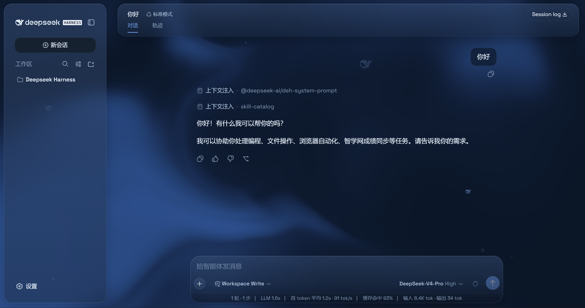
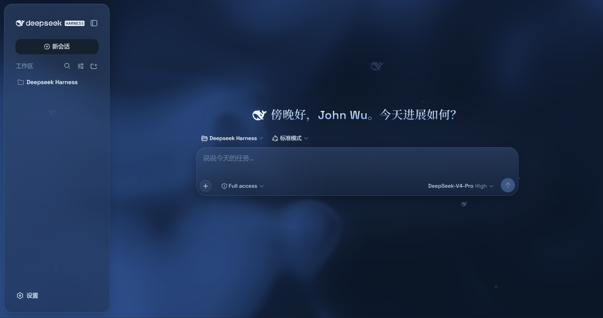
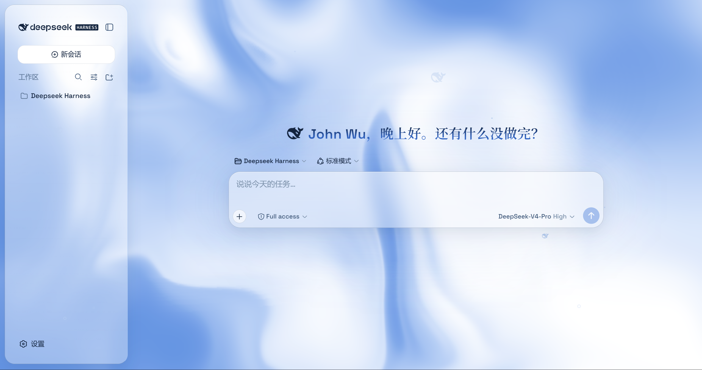
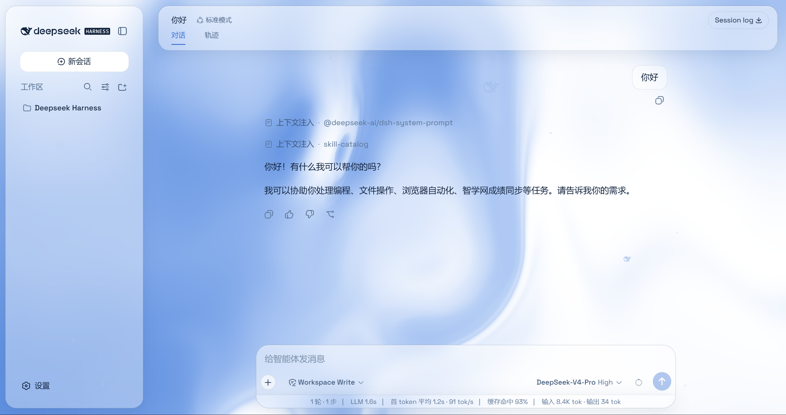

# @deepseek-ai/dsh-client-ui-aqua

[English](README.md) | 中文

Aqua 是一层套在 DeepSeek Harness 网页端外面的深海主题。它把整块界面换成深海里玻璃的质感——顶栏、侧边栏、输入框、统计行、轨迹视图都成了浮在水里的玻璃片，背后有一片缓慢流动的水，偶尔有几条鱼和气泡游过。深色模式是一片蓝黑的海，浅色模式是偏冷的蓝白。整层效果都藏在一个开关后面，随时可以关掉回到原生界面，不会改到 DSH 的任何一行源码。装上之后去「设置 → 插件」就能看到它。









## 自包含

Aqua 是**面向原版 DSH 的即装即用插件** —— 不要求改动 DSH 核心。样式表命中的目标要么原版 UI 已有（`data-composer-card`、`data-conversation-composer-overlay`、ARIA 角色、lightningcss 保留的类名子串），要么由插件的 `seam-stamper` **在运行时打上**（一个 MutationObserver，随 React 挂载给匹配元素补上 `data-dsh-*` / `data-hero-*` 锚点）。Space Grotesk 以 base64 `@font-face` **内嵌**进 bundle；中文显示文本刻意走系统衬线回退（宋体 / 华文宋体 / SimSun —— Noto Serif SC 是多 MB 的 unicode-range 字体，无法随插件分发）。开关标志是浏览器本地 `localStorage`，因此也不依赖 Host 设置命名空间。

## 安装

面向原版 DSH 部署（核心包需已发布，见 [发布](#发布)）：

1. 把插件装进承载 Web 客户端的 profile：

   ```sh
   npm install @deepseek-ai/dsh-client-ui-aqua@^0.1.0
   ```

2. 在 Web profile 的 `cordis.patch.yml` 里注册（放在其它 `dsh.client` 插件旁，例如 `ui-conversation` 之后）：

   ```yaml
   plugins:
     dsh.client:
       - insert:
           - id: ui-aqua
             name: '@deepseek-ai/dsh-client-ui-aqua'
   ```

3. 刷新 Web 界面。Aqua **默认开启**；在 **设置 → 插件 → Aqua** 中开关。

插件体（主题层、seam 打点器、设置卡片）全部位于 `./client` 导出 —— node 侧 `lib/index.js` 是为满足 Host Loader 契约而保留的空 `apply` 占位。


